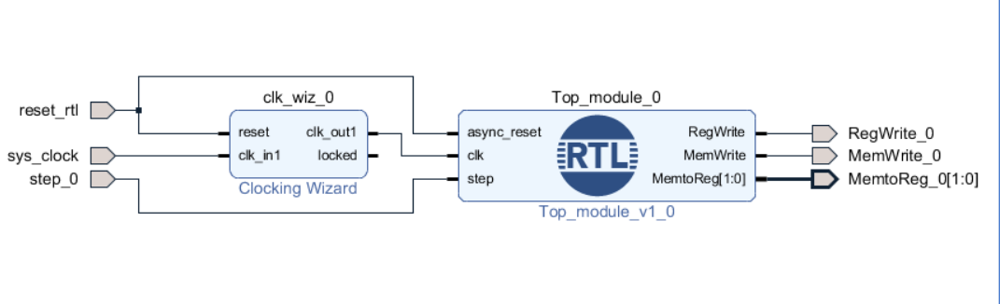

# Single-Cycle-Processor-FPGA-Verification-

2026/2/7

# RV32I Single Cycle Processor Verification by FPGA(PYNQ-Z2)

# Contents
- src : RV32I single processor
- Mem initialization : hex code for Instruction Memory
- design_1_bd.tcl : Block Design contents
- check.xdc : constraints file for PYNQ-Z2

# Environment
- Vivado (2017.3)
- FPGA : PYNQ-Z2

# Block Design 

# What Verification ?

- Sw1(D19) indicate `step wire` which increase pc. 
- Then check Control Signal about each pc.

|LED3 |LED2| LED1 |LED0|
| :---- | ------ | :----------: | --------------------: |
|memtoreg[1]|memtoreg[0] | memwrite| regwrite

# Limitation

- Not check all process like signature method whici my prevous simulation verification

# Next Goal

- Make Signature verification by using FPGA Bram.

